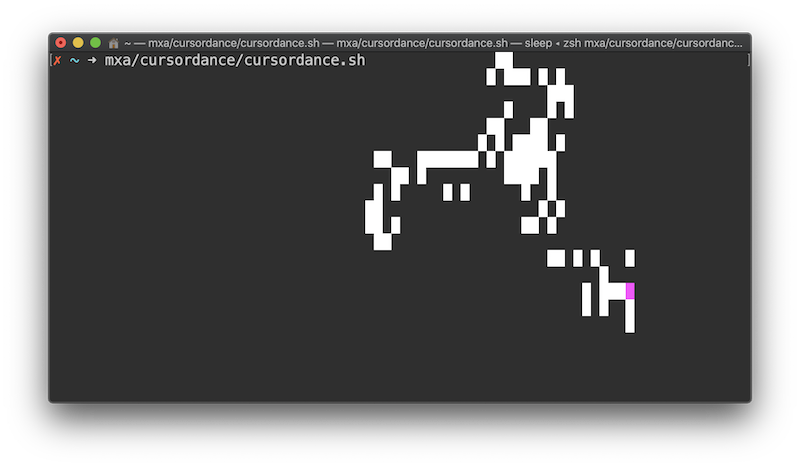
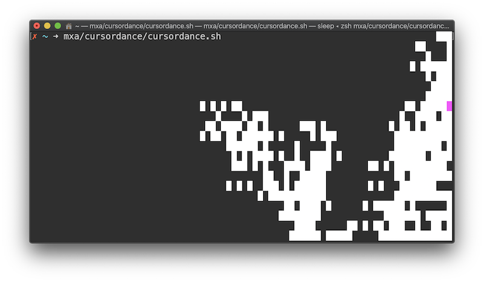

# cursordance

This draws white blocks all over your terminal.

### Caution

Your terminal might become a bit unreadable.
Maybe open a new one to try this out.

### Screenshots

### Requirements

- [ZSH](https://www.zsh.org)

### Why

I learned about cursors in terminal emulators, and needed to try something with
them.